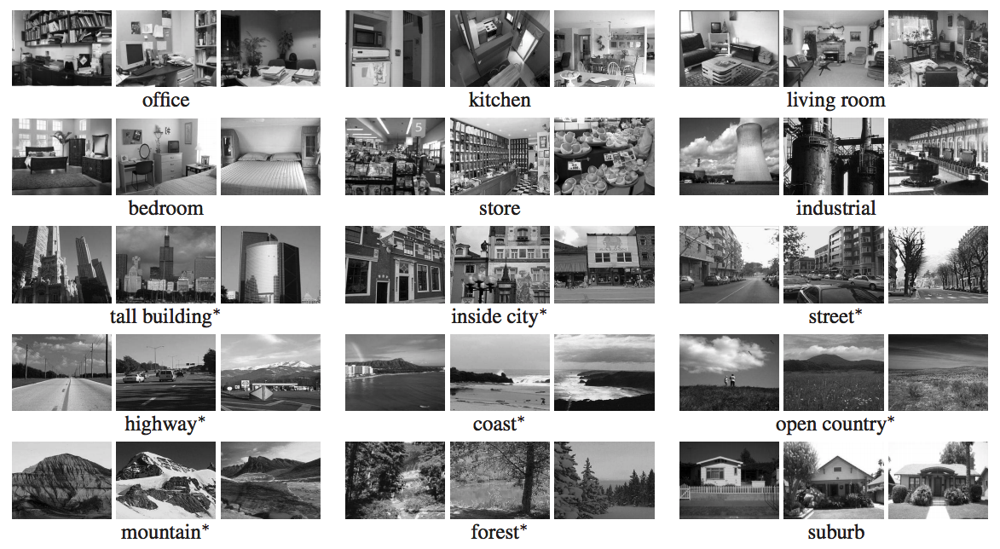

# Scene recognition fine-tune
- Fine-tuned and pre-trained deep ConvNet on scene dataset.
- Training AlexNet on GPU takes approximately 7 mins and achieved result is ~73.7% accuracy.
- Data augmentation and other pretrained model can be implemented to further improve the result.

Dataset:


## Training model
- Follow different Pytorch pretrained models in this link: http://pytorch.org/docs/master/torchvision/models.html
- Transfer learning tutorial using Pytorch can be found at: http://pytorch.org/tutorials/beginner/transfer_learning_tutorial.html

## Usage
```
python fine_tune.py
```
